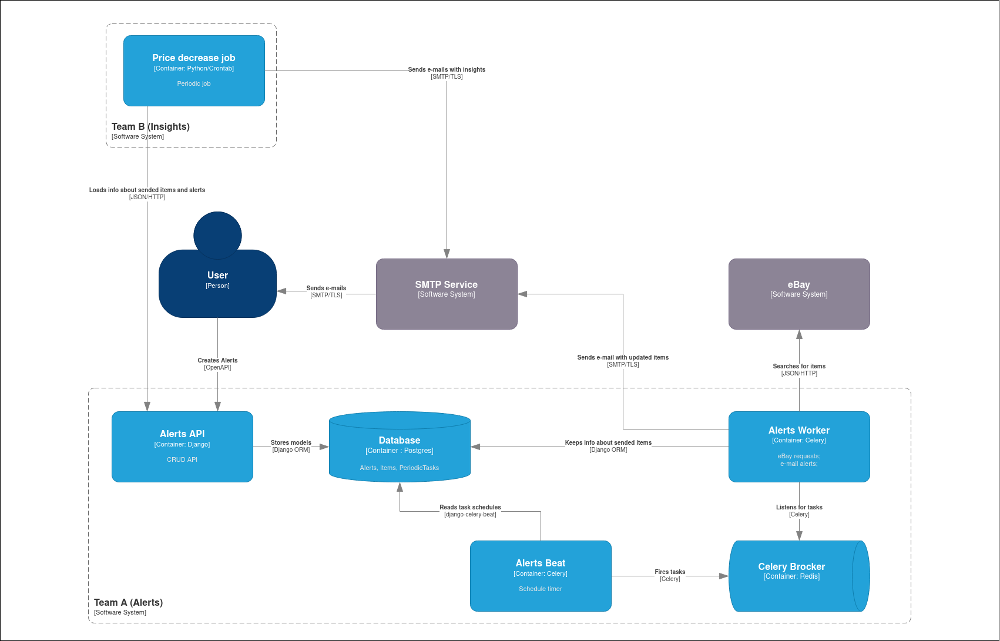

# Shore Alerts task

* CRUD for alerts
* Periodic e-mails with eBay product updates
* Periodic insights apout sended products
* Chosen insight: "Products with >2% price decrease over the last 2 days"

## How to
### Setup secrets
```bash
cp secrets.env.example secrets.env
```

Edit secrets: change sender e-mail, SMTP creds, eBay creds (sandbox or production)

### Run
```bash
docker compose up
```
Open [http://localhost:8080/](http://localhost:8080/)

### Run tests
```bash
./run tests
```

### Setup development environment
Development environment is configured fo VSCode Remote Container Extension.
Configuration is placed into `./.devcontainer` dir and ill should be loaded automatically

To run the development configuration of the whole system:
```bash
docker compose -f docker-compose.yml -f docker-compose.dev.yml up
```

## Architecture decisions
### Global architecture


> Since I had to use Django the main principle was "Use built-in plugins and tools everywhere you can."

### Alert scheduling
I chose Celery for asynchronous tasks.
`django-celery-beat` plugin allows to schedule tasks via DjangoORM and DB.
I connected `Alert` model to `PeriodicTask` model one-to-one relationship and a couple of ViewSet customizations. 
It allows to perform all operations (create; update/reschedule; delete/cancel) on both models in one transaction.

> Since user authorization is not required and we don't know about requirements regarding user-email-alerts relationship
> I didn't create separate `User` model.
> I just added `email` field into the `Alert` model.

### Alert sending
Each Celery task receives `PeriodicTask.id` argument, which allows to find task and connected alert from DB.
Then task queries items from eBay REST API, removes items that didn't change from the last launch, and sends e-mail via
Django SMTP tools.
Then it stores **all** (not only sended) items in DB for further analysis.

### Insight analysis
Since Team B is not alowed to share database with Team A, I chose to load data via Alert's CRUD API.
Thus all insight analysis is performed inside periodic Cron-like Python job.
This job requests data from Alert's API with appropreate sortings and group it with vanilla python utils.

> To be honest, I won't do this way in real production because it's a typical data analysis task with known practicies.
> In the real life denormalized data about sended e-mails will be stored in the stable data warehouse.
> Periodic jobs will be launched with ETL platforms (Apache Airflow, Dagster, etc.)
> And data analysis code will rely on warehouse's SQL queries or more advanced computational frameworks like Apache Spark.
>
> But since it is a basic example I just used oversimplified architecture which works for small workloads =)


